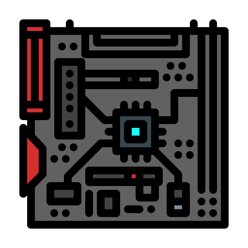

<!DOCTYPE html>
<html>
<head>
    <!-- the title, icon and charset used-->
    <meta charset="UTF-8">
    <title>Winterism Games</title>
    <meta name="viewport" content="width=device-width, initial-scale=1.0">

    <link rel="icon" type="image/x-icon" href="gamepageicon.ico">
    <link rel="stylesheet" href="styles.css">
</head>

<body>
    <!-- header of web page-->
    <pre style="color: #4d92cb;">
 __      __.__        __               .__                
/  \    /  \__| _____/  |_  ___________|__| ______ _____  
\   \/\/   /  |/    \   __\/ __ \_  __ \  |/  ___//     \ 
 \        /|  |   |  \  | \  ___/|  | \/  |\___ \|  Y Y  \
  \__/\  / |__|___|  /__|  \___  >__|  |__/____  >__|_|  /
       \/          \/          \/              \/      \/ 
    </pre>
    

    <h1 style="color: #4d92cb;">Welcome!</h1>
    

        
        We welcome to you to <b>Winterism's Game Book</b>! In which in this singular book, I will list all of my so far games that I <em>highly</em> would recommend. I will also include what the game is about in order for <b>better understanding</b> upon playing the game. Please note that I will also include my OWN opinion to these games. Let's first start off with some basic information about this webpage.

    <h2 style="color: #4d92cb;">Basic Information</h2>
    
This singular game page contains many video games including <em>2D</em> and <em>3D</em> video games. All video games in this webpage are recommended by my peers and myself, <b>Winterism.</b> Rest assured, the download links of each game are <b>safe</b> and had been checked & analyzed many times by me. All type of virus like malware, spyware or any other kind of computer virus is not included in the download links, so do not worry about getting them inside your operating system. 

    
All games in this website are from third-party websites or webpages for downloading a specific game. Please note that there are <b>no</b> games built-in to this webpage and only download links are in store.

    <h2><a href="https://osu.ppy.sh/home/download">osu!</a></h2>
    

        
        
osu! is a popular free-to-play rhythm game where players click circles, slide over tracks, and spin objects to the beat of a soundtrack. It features four distinct game modes   (osu!standard, osu!taiko, osu!catch, & osu!mania ), with the most popular being <b>osu!standard</b>. It also has customizable difficulty beatmaps, and a global community that  creates and shares thousands of user-made songs.

    

</body>

</html>
